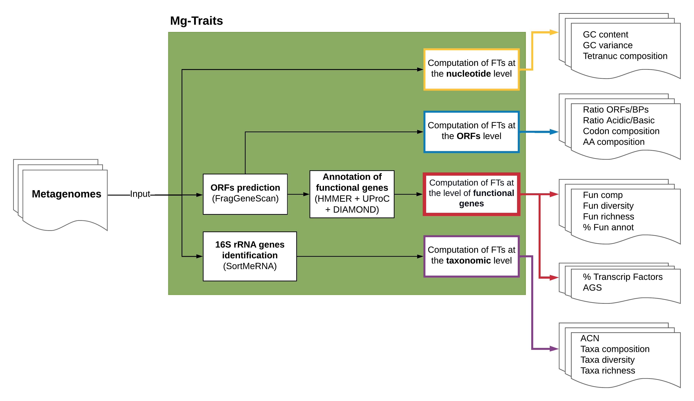

# 🌊 `Mg-Traits : Metagenomic Functional Trait Analysis`

{{Talk about NewAtlantis}}

`Mg-Traits` is a command line application programmed in BASH, AWK, and R, dedicated to the computation of
functional traits at the metagenome level (i.e., functional aggregated traits), ranging from GC variance and amino acid composition to functional diversity and average genome size. It takes as an input a preprocessed (unassembled) metagenomic sample and outputs the computed metagenomic traits organized in different tables and grouped in separate folders according to the type of data source. (see [Fig. 1](#figure1)). 

`Mg-Traits` allows the systematic computation of a comprehensive set of metagenomic functional traits, which can be used to generate a functional and taxonomic fingerprint and reveal the predominant life-history strategies and ecological processes in a microbial community. `Mg-Traits` contributes to improving the exploitation of metagenomic data and facilitates comparative and quantitative studies. Considering the high genomic plasticity of microorganisms and their capacity to rapidly adapt to changing environmental conditions, Mg-Traits constitutes a valuable tool to monitor environmental systems.

## ⚙️ `Getting Started`

`Mg-Traits` is simple to run! You can get started using it in one command for linux. Please note that the first time you run this script it will download a docker image and this may take some time. 

Ensure you have Docker runtime active at time of running this command.

```
wget https://github.com/new-atlantis-labs/Mg-Traits/blob/main/run_mg_traits.sh

chmod +x run_mg_traits.sh

./run_mg_traits.sh . . --help
```

Congratulations, you can now use `Mg-Traits`!  
Note: the first time you run this command it will download the docker image, and this can take a few minutes.

## 🧑‍💻 `Developers`

Looking to build `Mg-Traits` locally? Follow these steps. This route is only recommended for those looking to develop on top of Mg-Traits. The NewAtlantis container registry is recommended for most usecases.

First clone the repository and enter it.
```
git clone https://github.com/new-atlantis-labs/Mg-Traits.git

cd Mg-Traits
```

Then navigate into the folder `cont_env` and lastly build the dockerfile with.

```
cd cont_env

docker build mg-traits-local:1.0 .
```

## 🛠️ `Usage`
```
Usage: ./mg_traits.sh <input file> <output dir> <options>
--help                          print this help
--caz_subfam_annot t|f          annotate CAZyme subfamilies (default f)
--clean t|f                     remove intermediate files (i.e., *.info, *.ffn, *.faa, *.hout, *.uout) (default f)
--confidence NUM                confidence value to run rdp bayes classifier (from 0 to 100; default 50)
--evalue_acn NUM                evalue to filter reads for ACN computation (default 1e-15)
--evalue_div NUM                evalue to filter reads for diversity estimation (default 1e-15)
--evalue_res NUM                evalue to annotate ResFam with hmmsearch (default 1e-15)
--evalue_caz_fam NUM            evalue to annotate CAZyme families with hmmsearch (default 1e-15)
--evalue_caz_subfam NUM         evalue to annotate CAZyme subfamilies with hmmsearch (default 1e-15)
--evalue_hyd NUM                evalue to annotate Hyd with hmmsearch (default 1e-15)
--evalue_ncy NUM                evalue to annotate NCycle with diamond (default 1e-15)
--evalue_pcy NUM                evalue to annotate PCycle with diamond (default 1e-15)
--evalue_pls NUM                evalue to annotate Plastic DB with diamond (default 1e-15)
--nslots NUM                    number of threads used (default 12)
--max_length NUM                maximum read length used to trim reads (from the 3' end) for AGS computation (default 180)
--min_length NUM                minimum read length used to estimate taxonomic diversity (default 100)
--overwrite t|f                 overwrite previous directory (default f)
--ref_db CHAR                   reference database to run NBC (default silva_nr99_v138_train_set.fa.gz) 
--sample_name CHAR              sample name (default metagenomex)
--train_file_name CHAR          train file name to run FragGeneScan, see FragGeneScan help for options (default illumina_5)
--verbose t|f                   reduced verbose (default t)
--verbose_all t|f               complete verbose (default f)

<input file>: Fasta file used to compute mg-traits.
<output dir>: Output directory to store all computed ,g-traits.

```

## :rocket: `Output`
All files including computed traits have the format (tab separated): ```<sample name>  <trait>  <value>```  
This allows a straightforward concatenation of any specific trait computed in different samples.  
The computed traits are organized in 13 different folders, as shown below.
For each folder, we added a comment specifying the traits that are included.  

```
.
├── acn # Average 16S rRNA gene copy number (ACN)
│   ├── sample_acn.tsv
│   ├── sample_smrna.blast
│   ├── sample_smrna.fa
│   └── sample_smrna.log
├── ags # Average genome size (AGS)
│   ├── sample_ags.tsv
│   ├── sample_single_cogs_count.tsv
│   └── sample_uout.csv
├── bgc # Biosynthetic Gene Cluster domains (uproc)
│   ├── sample_bgc_annot.tsv
│   ├── sample_bgc_stats.tsv
│   └── sample.uout
├── caz # Carbohydrate active enzymes (CAZymes families and subfamilies) (hmmsearch)
│   ├── sample_caz_fam_annot.tsv
│   ├── sample_caz_fam.domtblout
│   ├── sample_caz_fam.hout
│   ├── sample_caz_fam_stats.tsv
│   ├── sample_caz_sub_annot.tsv
│   ├── sample_caz_sub.domtblout
│   ├── sample_caz_sub.hout
│   └── sample_caz_sub_stats.tsv
├── fun # Pfam (uproc)
│   ├── sample_fun_annot.tsv
│   ├── sample_fun_stats.tsv
│   └── sample.uout
├── hyd # Hydrocarbon degradation enzymes (hmmsearch)
│   ├── sample.domtblout
│   ├── sample.hout
│   ├── sample_hyd_annot.tsv
│   └── sample_hyd_stats.tsv
├── ncy # Nitrogen cycling genes (diamond)
│   ├── sample.blout
│   ├── sample_ncy_annot.tsv
│   └── sample_ncy_stats.tsv
├── nuc # Nucleotide composition 
│   ├── sample.compseq
│   ├── sample_gc_stats.tsv
│   ├── sample.info.gz
│   └── sample_nuc_comp
├── orf # Open Reading Frames (FragGeneScanRs)
│   ├── sample_aa_comp.tsv
│   ├── sample_codon_comp.tsv
│   ├── sample.cusp
│   ├── sample.faa.gz
│   ├── sample.ffn.gz
│   └── sample_orf_stats.tsv
├── pcy # Phosphorus cycling genes (diamond)
│   ├── sample.blout
│   ├── sample_pcy_annot.tsv
│   └── sample_pcy_stats.tsv
├── pls # Plastic degradation enzymes (diamond)
│   ├── sample.blout
│   ├── sample_pls_annot.tsv
│   └── sample_pls_stats.tsv
├── res # Antibiotic resistance genes (hmmsearch)
│   ├── sample.domtblout
│   ├── sample.hout
│   ├── sample_res_annot.tsv
│   └── sample_res_stats.tsv
└── tax # Taxonomy (naive bayes classifier)
    ├── sample_centroids.fasta
    ├── sample_div.tsv
    ├── sample_sample2otu2abund2taxa.tsv
    ├── sample_subseq.fasta
    └── sample.uclust
```

The acn and ags outputs are explained [here](https://github.com/pereiramemo/AGS-and-ACN-tools).

Functional composition (i.e., bgc, caz, fun, hyd, ncy, pcy, and res):   
The *_stats.tsv files have the shannon diversity, richness and percentage of ORFs annotated.  
The *_annot.tsv files are the gene counts tables.  
The \*.domtblout, \*.hout and the hmmsearch outputs, and the \*.uout and \*.blout are uproc and diamond outputs, resp.  
 
Nucleotide composition (i.e., nuc):  
\*.compseq is the compseq (EMBOSS) output.  
\*.nuc_comp is the tetranucleotide tab formatted output.  
\*.info is the infoseq (EMBOSS) output.  
\*.gc_stats.tsv are the GC mean and variance.  
 
Open Reading Frames annotation (i.e., orf):  
*_aa_comp.tsv is the amino acid composition.  
*_codon_comp.tsv is the codon composition.  
*.cusp is the cusp (EMBOSS) output.  
*.faa.gz  are the ORF amino acid sequences.  
*.ffn.gz are the ORF nucleotide sequences.  
 
Taxonomic annotation (i.e., tax):  
*_centroids.fasta are the cluster centroid sequences.  
*_div.tsv are diversity and richness estimates.  
*_sample2otu2abund2taxa.tsv is the taxonomic annotation output.  
*_subseq.fasta 16s rRNA genes extracted from reads.  
*.uclust is the uclust output.  


## 📈 `Workflow description`

<a name="figure1">
</a>



__Figure 1. Mg-Traits pipeline. The metagenomic traits computed by the Mg-Traits pipeline are divided into four different groups.__ 
The first includes the metagenomic traits computed at the nucleotide level: GC content, GC variance, and  Tetranucleotide frequency. The second group includes the traits obtained from the open reading frame (ORF) sequence data: ORFs to Base Pairs (BPs) ratio, Codon frequency, Amino acid frequency, and Acidic to basic amino acid ratio. The third group is based on the functional annotation of the ORF amino acid sequences. For this, we use [Pfam](https://www.ebi.ac.uk/interpro/) and another seven specialized databases: [Biosynthetic Gene Cluster (BGC) domains](https://github.com/pereiramemo/BiG-MEx), [Resfams](http://www.dantaslab.org/resfams), [CANT-HYD](https://github.com/dgittins/CANT-HYD-HydrocarbonBiodegradation),
[NCyc](https://github.com/qichao1984/NCyc), [PCyc](https://github.com/ZengJiaxiong/Phosphorus-cycling-database), [PlastidDB](https://plasticdb.org/), and [CAZymes](https://bcb.unl.edu/dbCAN/). For each reference database, we compute the Composition, Diversity, Richness, and Percentage of Annotated Genes. Additionally, this group includes the percentage of transcription factors (TFs) and the average genome size [AGS](https://github.com/pereiramemo/AGS-and-ACN-tools). Lastly, in the fourth group are included the taxonomy-related metagenomic traits: average copy number of 16S rRNA genes [ACN](https://github.com/pereiramemo/AGS-and-ACN-tools), Taxonomic Composition, Diversity, and Richness.  

## 🗂 `Project Organization`
```
├── LICENSE
├── README.md                                   <- The top-level README for developers using this project.
├── cont_env
│   ├── Dockerfile
│   ├── resources
│   │   ├── Pfam_v28.0_acc.txt
│   │   ├── PlasticDB.fasta.gz
│   │   ├── TF.txt
│   │   └── all_cog_lengths.tsv
│   └── software
│       └── mg_traits
│           ├── conf.sh
│           ├── funs.sh
│           ├── mg_traits.sh
│           ├── modules
│           │   ├── module10_pcy_mg_traits.sh
│           │   ├── module11_pls_mg_traits.sh
│           │   ├── module1_nuc_mg_traits.sh
│           │   ├── module2_orf_mg_traits.sh
│           │   ├── module3_fun_mg_traits.sh
│           │   ├── module4_tax_mg_traits.sh
│           │   ├── module5_res_mg_traits.sh
│           │   ├── module6_bgc_mg_traits.sh
│           │   ├── module7_caz_mg_traits.sh
│           │   ├── module8_hyd_mg_traits.sh
│           │   └── module9_ncy_mg_traits.sh
│           └── toolbox
│               ├── acn.sh
│               ├── ags.sh
│               ├── taxa_annot_DADA2.R
│               └── taxa_annot_rRDP.R
├── figures
│   ├── Mg-Traits2.png
│   └── Mg_Traits-ENG.png
└── run_mg_traits.sh
```

## 🚗 `Dependancies`
**Mg-Traits utilizes the following tools**:  
[AGS and ACN tools](https://github.com/pereiramemo/AGS-and-ACN-tools)  
[BBTools](https://jgi.doe.gov/data-and-tools/bbtools/bb-tools-user-guide/bbduk-guide) 
[DADA2](https://benjjneb.github.io/dada2/)  
[diamond](https://github.com/bbuchfink/diamond)  
[EMBOSS](http://emboss.sourceforge.net/)  
[FragGeneScanRs](https://github.com/unipept/FragGeneScanRs)  
[HMMER](http://hmmer.org)  
[R](https://www.r-project.org)  
[seqtk](https://github.com/lh3/seqtk)  
[SortMeRNA](https://github.com/sortmerna/sortmerna)  
[tidyverse](https://www.tidyverse.org)  
[UProC](http://uproc.gobics.de/)  
[VSEARCH](https://github.com/torognes/vsearch)  

**and databases**:  
[BGC domains](https://github.com/pereiramemo/BiG-MEx)  
[CANT-HYD](https://github.com/dgittins/CANT-HYD-HydrocarbonBiodegradation)  
[dbCAN and dbCAN-sub](https://bcb.unl.edu/dbCAN2)  
[NCYc](https://github.com/qichao1984/NCyc)  
[PCyc](https://github.com/ZengJiaxiong/Phosphorus-cycling-database)  
[Pfam (UProC format)](http://uproc.gobics.de)  
[PlasticDB](http://plasticdb.org/)  
[Resfams](http://www.dantaslab.org/resfams)  
[Silva SSU nr99 (DADA2 format)](https://zenodo.org/record/3986799)  


## 📝 `Please Cite`
```
Pereira-Flores E, Barberan A, Glöckner FO, Fernandez-Guerra A (2021) Mg-Traits pipeline: advancing functional trait-based approaches in metagenomics. ARPHA Conference Abstracts 4: e64908. https://doi.org/10.3897/aca.4.e64908
```


## 📲 `Contact`
Please reach out with any comments, concerns, or discussion regarding `Mg-Traits`. It is primarly maintained by Emliano Perea for NewAtlantis Labs.

> [](https://discord.gg/newatlantis)
[](https://twitter.com/NewAtlantisDAO)
[](epereira@newatlantis.io)
[](https://orcid.org/0000-0001-5830-3328)


